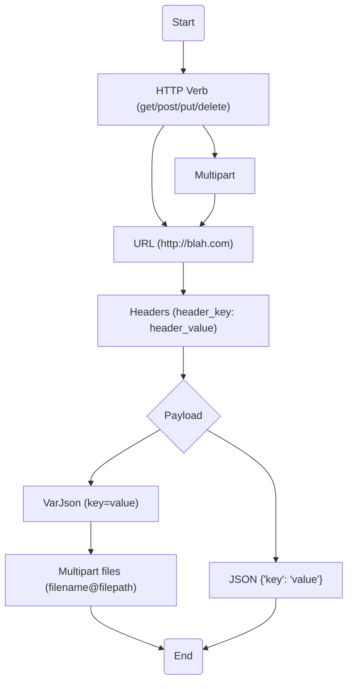

# `Lama2`: Plain-text powered REST API client

`Lama2` is a plain-text powered REST API client & manager. *Lama2* provides the following benefits to software engineers:

1. **Easy syntax:** Store your APIs in the simple, human-friendly and plain-text `.http` files. You can learn basic syntax within  minutes!
1. **Simple CLI:** *Lama2* ships with a simple CLI tool `l2` which can be used to execute `.http` files to make REST requests.
1. **Editor support:** Invoke *Lama2* from within your favorite text editor or IDE. Make requests right from your editor
with *Lama2* plugins.
1. **Longevity & trackability:** Plain-text storage format that can be committed to `git` or other version control. We recommend creating repositories to host your API files.
1. **Collaboration:** Straightforward collaboration with your team through version control, as you will do with any other software artifact.
1. **Extensibility:** The grammar for the `.http` language is implemented using a recursive descent parser. One can implement new syntax to evolve the file format, say for supporting `websockets`, without any ambiguity.
1. **Documentation:** *Lama2* comes with tutorials, how-tos, explanations, references, FAQ/RAQs, and diagrams. We invest significant efforts to ensure you are never lost in figuring out any aspect of *Lama2*.

[[_TOC_]]

## How-to

TODO

## Tutorial

TODO

## Explanation

### Syntax Guidance

The following is the *recommended* flow for an `.http` file. The grammar offers some additional flexibilities in ordering the various components, but it is preferable to
stick to the following ordering to 
help with understanding.



## Reference


TODO

## General Usage

Simply type any of the following to get options (option support is in progress):

```
elf
elf -h 
elf --help
```

Find some sample request files in the `sample_http` folder.

### Prettification

To fix messed up JSONs in place:

```
elf -p file.http
```

Prettify all files in a directory (useful for large API collections such as FW-specific
APIHub):
```
find . -type f -name "*.http" -exec elf -p {} \
```

### Installation

If you're on ubuntu, just run:

```
git clone git@gitlab.com:flyweightgroup/httpelf.git
./install.sh
```

This will install golang/httpie if necessary,
build `httpelf` and finally move the binary
into `/usr/bin` (`/usr/local/bin` in macOS)

### Updates

If you're on ubuntu, just run:

```
git pull
./install.sh
```

**Note:** overwrites the existing binary in `/usr/bin` (`/usr/local/bin` in macOS)

## FW-specific workflow

1. Pull/Clone `httpelf` repo. 
1. Run `./install.sh (will update the binary if code has updated)

1. Clone [APIHub](https://gitlab.com/flyweightgroup/apihub) repo. 
1. Create a folder for your service (ex: `impression_collector`)
1. Start defining `*.http` files for each service specific API. 
1. Use `elf file.http` to test the newly defined APIs. 
1. Push the API files once ready into APIHub repo

## `.http` format

### Comments start with `#`

Lines starting with `#` are comments and hence ignored altogether

### All HTTP Verbs supported - including the common GET/POST/PUT

Fully supported: `GET|HEAD|POST|PUT|DELETE|CONNECT|OPTIONS|TRACE|PATCH`

### JSON is the default submission type, but MULTIPART is supported too


#### `varjson` is a simpler syntax to specify flat JSONs

`varjson` values are defined as follows:

```
hello=world
foo=bar
```

The above results in a JSON submission of the form:

```
{
	"hello": "world",
	"foo": "bar"
}
```

#### Nested JSON can simply be dumped into the document at any place

Check the `sample_http` directory for numerous examples of this format.

####  Cookies are sent as headers

Cookies are specified in a `Cookie` header as follows:

```
Cookie:'sessionid=foo;another-cookie=bar'
```

#### MULTIPART allows both file uploads & the usual fields

Example:

```
POST
MULTIPART
http://localhost:8000/register
userid=lince5
file@./helloworld.jpg
```

Note that *file path is relative to the request file.*

### Environments variables/commands can be defined in `<requests_dir>/elf.env`

By default, `elf` looks for a `elf.env` file in the same directory as the given
request file directory. Example `elf.env`:

```
export PHOTO=`base64 aadhaarlarge.jpg`
export AHOST="http://localhost:8000"
```

#### Base64 of images can be obtained through an environment command

In the previous section, we defined the `PHOTO` variable as a shell command.
The results of the command can be used in a requests file as follows:

```
POST
${AHOST}/aadhaarscanjson

{
	"aadhaarfileb64": "'${PHOTO}'",
	"coords": "130,327,539,331,564,607,107,617",
	"uemail": "shrijith.sv@gmail.com"
}
```

Note that within a nested JSON, it is **madatory* to use single quotes around
a variable expansion. This is present limitation of the `elf` system. It is 
ideal to avoid this syntax, however given time/energy constraints we are not 
picking up the issue. Please use the above as a template in the interim.


### Find examples in `sample_http` folder

Please explore `sample_http` folder to see some samples, and get a feel for
how things are defined within `.http` files.

## Development

### Testing

```
go test -v
```