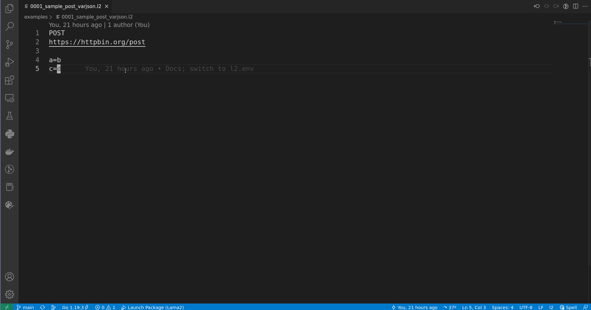

# `Lama2`: Plain-text Powered REST API Client


<div align="center">


[](https://goreportcard.com/report/github.com/HexmosTech/lama2)

*Quick Links: [Installation](#installation) | [Demo](#terminal-demo-a-post-request) | [Full Documentation](https://hexmos.com/lama2)*
</div>


## About

*Lama2* is a plain-text powered REST API client & manager built for serious engineering teams.
*Lama2* specifies the [`.l2` syntax](https://hexmos.com/lama2/tutorials/examples.html) for describing APIs, and implements a [CLI](https://hexmos.com/lama2/tutorials/installation.html) to execute `.l2` files. Engineers can [collaborate](https://hexmos.com/lama2/tutorials/collaboration.html) on `.l2` files using version control. *Lama2* [integrates](https://hexmos.com/lama2/tutorials/editor.html) nicely with
IDEs and text-editors as well. Think of *Lama2* as [**markdown for APIs.**](https://hexmos.com/lama2/reference/philosophy.html)

## Benefits 

1. **Plain-text files:** Store APIs in the plain-text `.l2` API files. [Simple](https://hexmos.com/lama2/explanation/l2format.html) and [human-friendly](https://hexmos.com/lama2/explanation/syntax.html) syntax. Learn [basics](https://hexmos.com/lama2/tutorials/examples.html) within  minutes!
1. **Simple CLI:** Launch the [CLI](https://hexmos.com/lama2/tutorials/installation.html) tool `l2` on API files to make REST API requests.
1. **Editor support:** Invoke *Lama2* from your [favorite text editor](https://hexmos.com/lama2/tutorials/installation.html#from-vs-code) or IDE. Helpful documentation and tool support to build editor extensions included.
1. **Longevity & track-ability:** Commit `.l2` files to `git` or other version control for long life & change tracking.
1. **Collaboration:** Share [API repo](https://hexmos.com/lama2/tutorials/collaboration.html) with teammates and colleagues to collaborate
1. **Documentation:** [Explore](https://hexmos.com/lama2/index.html) examples, how-tos, explanations, references, FAQ/RAQs, and diagrams. Documentation is a priority, so that you never have to get lost.
1. **Extensibility:** `.l2` syntax is implemented as a *recursive descent parser*, based on a [formal grammar](https://hexmos.com/lama2/reference/grammar.html). [Dig into details](https://hexmos.com/lama2/reference/parser.html) and [implement](https://github.com/HexmosTech/Lama2/tree/main/parser) new syntax (ex: to support `websockets`)

## Terminal Demo: A POST request


## VSCode Demo: The same POST request



## Installation/Update

For **Linux/MacOS** systems, run the following command to either install or update *Lama2*:

```
curl -s https://raw.githubusercontent.com/HexmosTech/Lama2/main/install.sh | bash -s
```

Learn more about other installation methods from [our docs](https://hexmos.com/lama2/tutorials/installation.html).

### VSCode Extension

Find *Lama2 for VSCode* at the [VSCode Marketplace](https://marketplace.visualstudio.com/items?itemName=hexmos.Lama2). The extension requires the *l2* command available (usually at `/usr/local/bin/l2`).

## Design Philosophy

1. Delegate subtasks to open and mature tools:
    1. API Collaboration - git
    1. API Organization - OS file system
    1. API Editing - VSCode/IDEs
    1. API Requests - HTTPie
1. Start a language formalization effort from the beginning (learning from Markdown history)
1. Keep language syntax simple
1. Invest into good documentation
1. Strive to keep components decoupled


## Community and Support

1. [Full documentation @hexmos.com/lama2](https://hexmos.com/lama2/)
1. Report issues and propose improvements at [Github issues](https://github.com/HexmosTech/Lama2/issues)
1. Discuss with the community at [Discord](https://discord.gg/zTmxXA6F)
