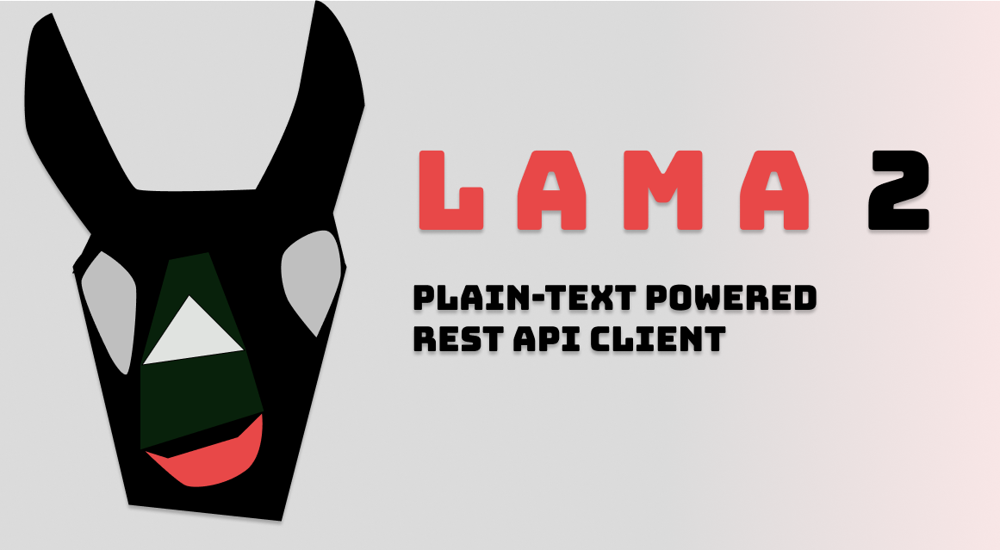

# `Lama2`: Plain-text Powered REST API Client


<div align="center">



[](https://goreportcard.com/report/github.com/HexmosTech/lama2)
</div>

*Quick Links: [Installation](#installation) | [Demo](#terminal-demo-a-post-request) | [Full Documentation](TODO)*

## About

*Lama2* is a plain-text powered REST API client & manager built for serious engineering teams.
*Lama2* specifies the .l2 syntax for describing APIs, and implements a CLI to execute .l2 files. Engineers can collaborate on `.l2` files using version control. *Lama2* integrates nicely with
IDEs and text-editors as well. Think of *Lama2* as **markdown for APIs.**

## Benefits 

1. **Plain-text files:** Store APIs in the plain-text `.l2` API files. Simple and human-friendly syntax. Learn basics within  minutes!
1. **Simple CLI:** Launch the CLI tool `l2` on API files to make REST API requests.
1. **Editor support:** Invoke *Lama2* from your favorite text editor or IDE. Helpful documentation and tool support to build editor extensions included.
1. **Longevity & track-ability:** Commit `.l2` files to `git` or other version control for long life & change tracking.
1. **Collaboration:** Share API repo with teammates and colleagues to collaborate
1. **Documentation:** Explore tutorials, how-tos, explanations, references, FAQ/RAQs, and diagrams. Documentation is a priority, so that you never have to get lost.
1. **Extensibility:** `.l2` syntax is implemented as a *recursive descent parser*, based on a clearly specified grammar. Dig into details and implement new syntax (ex: to support `websockets`)

## Terminal Demo: A POST request


## VSCode Demo: The same POST request


## Installation

```
curl -s https://raw.githubusercontent.com/HexmosTech/Lama2/main/install.sh | bash -s
```

Learn more about other installation methods
from our docs.


## General Usage

Simply type any of the following to get options (option support is in progress):

```
elf
elf -h 
elf --help
```

Find some sample request files in the `sample_http` folder.

### Prettification

To fix messed up JSONs in place:

```
elf -p file.l2
```

Prettify all files in a directory (useful for large API collections such as FW-specific
APIHub):
```
find . -type f -name "*.l2" -exec elf -p {} \
```

### Installation

If you're on ubuntu, just run:

```
git clone git@gitlab.com:flyweightgroup/httpelf.git
./install.sh
```

This will install golang/httpie if necessary,
build `httpelf` and finally move the binary
into `/usr/bin` (`/usr/local/bin` in macOS)

### Updates

If you're on ubuntu, just run:

```
git pull
./install.sh
```

**Note:** overwrites the existing binary in `/usr/bin` (`/usr/local/bin` in macOS)

## FW-specific workflow

1. Pull/Clone `httpelf` repo. 
1. Run `./install.sh (will update the binary if code has updated)

1. Clone [APIHub](https://gitlab.com/flyweightgroup/apihub) repo. 
1. Create a folder for your service (ex: `impression_collector`)
1. Start defining `*.l2` files for each service specific API. 
1. Use `elf file.l2` to test the newly defined APIs. 
1. Push the API files once ready into APIHub repo

## `.l2` format

### Comments start with `#`

Lines starting with `#` are comments and hence ignored altogether

### All HTTP Verbs supported - including the common GET/POST/PUT

Fully supported: `GET|HEAD|POST|PUT|DELETE|CONNECT|OPTIONS|TRACE|PATCH`

### JSON is the default submission type, but MULTIPART is supported too


#### `varjson` is a simpler syntax to specify flat JSONs

`varjson` values are defined as follows:

```
hello=world
foo=bar
```

The above results in a JSON submission of the form:

```
{
	"hello": "world",
	"foo": "bar"
}
```

#### Nested JSON can simply be dumped into the document at any place

Check the `sample_http` directory for numerous examples of this format.

####  Cookies are sent as headers

Cookies are specified in a `Cookie` header as follows:

```
Cookie:'sessionid=foo;another-cookie=bar'
```

#### MULTIPART allows both file uploads & the usual fields

Example:

```
POST
MULTIPART
http://localhost:8000/register
userid=lince5
file@./helloworld.jpg
```

Note that *file path is relative to the request file.*

### Environments variables/commands can be defined in `<requests_dir>/elf.env`

By default, `elf` looks for a `elf.env` file in the same directory as the given
request file directory. Example `elf.env`:

```
export PHOTO=`base64 aadhaarlarge.jpg`
export AHOST="http://localhost:8000"
```

#### Base64 of images can be obtained through an environment command

In the previous section, we defined the `PHOTO` variable as a shell command.
The results of the command can be used in a requests file as follows:

```
POST
${AHOST}/aadhaarscanjson

{
	"aadhaarfileb64": "'${PHOTO}'",
	"coords": "130,327,539,331,564,607,107,617",
	"uemail": "shrijith.sv@gmail.com"
}
```

Note that within a nested JSON, it is **madatory* to use single quotes around
a variable expansion. This is present limitation of the `elf` system. It is 
ideal to avoid this syntax, however given time/energy constraints we are not 
picking up the issue. Please use the above as a template in the interim.


### Find examples in `sample_http` folder

Please explore `sample_http` folder to see some samples, and get a feel for
how things are defined within `.l2` files.

## Development

### Testing

```
go test -v
```