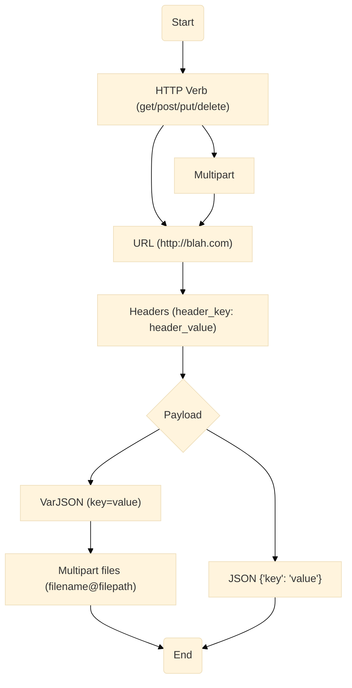

# Explanation

## Syntax Guidance

The following is the *recommended* flow for an `.l2` file. The grammar offers some additional flexibilities in ordering the various components, but it is preferable to
stick to the following ordering to 
help with understanding.

