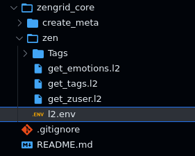
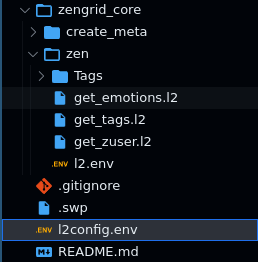

Find in this page an informal description of
the rules for authoring `.l2` API files. This
document expects some familiarity with *Lama2*.

To quickly get started with *Lama2*, head over
to [Examples](../tutorials/examples.md).

On the
other hand, if you are a developer and wish to
learn more about the formal grammar underlying
*l2*, visit the [Grammar](../reference/grammar.md)
section.

### Comments start with `#`

Lines starting with `#` are comments and hence ignored altogether

### All HTTP Verbs supported - including the common GET/POST/PUT

Fully supported: `GET|HEAD|POST|PUT|DELETE|CONNECT|OPTIONS|TRACE|PATCH`

### JSON is the default submission type, but MULTIPART is supported too

#### `varjson` is a simpler syntax to specify flat JSONs

`varjson` values are defined as follows:

```
hello=world
foo=bar
```

The above results in a JSON submission of the form:

```
{
	"hello": "world",
	"foo": "bar"
}
```

#### Nested JSON can simply be dumped at the end of the document

The JSON recognition engine is quite lenient. It can deal with
minor errors in the format (such as having single quotes instead
of double quotes, trailing garbage, or an extra comma after the
last element in an array,).

```
POST
https://httpbin.org/post

{
    "a": "b",
    "c": "d"
}
```

#### MULTIPART allows both file uploads & the usual fields

Example:

```
POST
MULTIPART
http://localhost:8000/register
userid=lince5
file@./helloworld.jpg
```

!!! Note

    The *file path is relative to the request file.*

### Cookies are sent as headers

Cookies are specified in a `Cookie` header as follows:

```
Cookie:'sessionid=foo;another-cookie=bar'
```


### Environment Variables

#### API variables can be defined in `apirequest.l2`
Variables are declared within the JS processor block and serve as dynamic placeholders for data used in API requests. 
By utilizing these variables, L2 enables flexibility and reusability in defining API endpoints and data payloads.

Example `login.l2`:

```
let REMOTE = "httpbin.org"
let EMAIL = "customer1@gmail.com"

---

POST
${REMOTE}/login
{
  "email": "${EMAIL}",
  "password": "customer1@gmail.com"
}
```

Get [Source Files](https://github.com/HexmosTech/Lama2/tree/main/examples/0021_varjson_variable/0021_varjson_variable.l2)


#### API environment variables can be defined locally in `l2.env`
L2 provides a convenient way to define environment variables through the l2.env file. 
This file is automatically searched for in the present directory, 
and its contents are loaded to create a set of variables (local).

In the `l2.env` file, you can specify environment-specific values for variables used in your L2 scripts, such as URLs, authentication tokens, or any other data that may vary depending on the environment in which the API requests are executed.



Go to [Example](../tutorials/examples.md#case-1-l2env-adjacent-to-an-api-file)

Get [Source File](https://github.com/HexmosTech/Lama2/tree/main/examples/0023_l2env_declare)


#### API environment variables can be defined at project root using `l2config.env`
The `l2config.env` file serves as a centralized storage for environment variables located at the project root, streamlining the management of configuration settings across all L2 scripts. With this file present, every L2 script within the project automatically inherits the defined variables, effectively eliminating the necessity to duplicate configurations in individual subdirectories using `l2.env`.

The search for `l2config.env` extends from the present directory up to the root directory (`/`). During this process, the variables defined in the root file are loaded and made available for use in all relevant scripts. This approach significantly enhances efficiency and maintainability, as it ensures consistent settings throughout the project while reducing redundancy in configuration data.


Go to [Example](../tutorials/examples.md#case-2-root-variables)

Get [Source File](https://github.com/HexmosTech/Lama2/tree/main/examples/0022_l2config_declare)


#### If `l2config.env`(root) variables are redeclared in `l2.env`(local)
In situations where both root and local variables share the same variable name, the local variable takes precedence over the root variable. This behavior remains consistent, even if both `l2config.env` (root) and `l2.env` (local) files reside in the same directory. 

The local variable's value will always be considered over the root variable, ensuring that specific configurations defined at the local level effectively override any corresponding settings present in the root file. This approach provides developers with granular control and flexibility in tailoring environment variables to suit specific needs within different parts of the project while maintaining the overall structure and organization of configuration settings.



Go to [Example](../tutorials/examples.md#case-3-override-root-variable-with-local-variable)

Get [Source File](https://github.com/HexmosTech/Lama2/tree/main/examples/0020_override_project_root_local)


### The environment file can load results of commands

Use the backtick notation `\`command\`` to place the results of
commands into environment variables:

```
export PHOTO=`base64 image.jpeg`
```

One can load the `PHOTO` variable in API files.


### Chain requests through Javascript blocks

*Lama2* supports plain Javascript (JS) blocks
as a glue for manipulating responses and passing on
values to later stages. At a higher
level, a chain of requests may look like:

```
Javascript 1
---
L2 Request 1
---
Javscript 2
---
L2 Request 2
```

The triple-dash (`---`) separator is mandatory. The special
variable `result` contains the response from previous stages.

For example, in the above case, `Javascript 2` can access the response from `L2 Request 1` through the `result` variable.

Learn more about request chaining in [Examples](../tutorials/examples.md#chain-requests-using-javascript).
