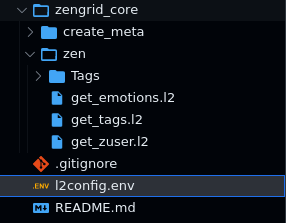

Find in this page an informal description of
the rules for authoring `.l2` API files. This
document expects some familiarity with *Lama2*.

To quickly get started with *Lama2*, head over
to [Examples](../tutorials/examples.md).

On the
other hand, if you are a developer and wish to
learn more about the formal grammar underlying
*l2*, visit the [Grammar](../reference/grammar.md)
section.

### Comments start with `#`

Lines starting with `#` are comments and hence ignored altogether

### All HTTP Verbs supported - including the common GET/POST/PUT

Fully supported: `GET|HEAD|POST|PUT|DELETE|CONNECT|OPTIONS|TRACE|PATCH`

### JSON is the default submission type, but MULTIPART is supported too

#### `varjson` is a simpler syntax to specify flat JSONs

`varjson` values are defined as follows:

```
hello=world
foo=bar
```

The above results in a JSON submission of the form:

```
{
	"hello": "world",
	"foo": "bar"
}
```

#### Nested JSON can simply be dumped at the end of the document

The JSON recognition engine is quite lenient. It can deal with
minor errors in the format (such as having single quotes instead
of double quotes, trailing garbage, or an extra comma after the
last element in an array,).

```
POST
https://httpbin.org/post

{
    "a": "b",
    "c": "d"
}
```

#### MULTIPART allows both file uploads & the usual fields

Example:

```
POST
MULTIPART
http://localhost:8000/register
userid=lince5
file@./helloworld.jpg
```

!!! Note

    The *file path is relative to the request file.*

### Cookies are sent as headers

Cookies are specified in a `Cookie` header as follows:

```
Cookie:'sessionid=foo;another-cookie=bar'
```

### Environment Variables: Switch base URL

#### API variables can be defined in `apirequest.l2`

L2 uses the variables declared inside the `.l2` file and makes the request

Example `login.l2`:

```
let REMOTE = "httpbin.org"
let EMAIL = "customer1@gmail.com"

---

POST
${REMOTE}/login
{
  "email": "${EMAIL}",
  "password": "customer1@gmail.com"
}
```

Get [Source Files](https://github.com/HexmosTech/Lama2/tree/main/examples/0021_varjson_variable/0021_varjson_variable.l2)


#### API environment variables can be defined locally in `l2.env`

`l2.env` is searched for, from the present directory and variables(local) are loaded from this file.

Example `l2.env`:

```
export PHOTO=`base64 aadhaarlarge.jpg`
export AHOST="http://localhost:8000"
```


Get [Source File](https://github.com/HexmosTech/Lama2/tree/main/examples/0023_l2env_declare)

#### API environment variables can be defined at project root using `l2config.env`
`l2config.env` is searched for, from the present directory to all its ancestors (upto `/`) and 
variables(root) are loaded from this file.
Example `l2config.env`:

```
export PHOTO=`base64 aadhaarsmall.jpg`
export AHOST="http://localhost:8001"
```



Get [Source File](https://github.com/HexmosTech/Lama2/tree/main/examples/0022_l2config_declare)

#### If `l2config.env`(root) variables are redeclared in `l2.env`(local)

The local variable's value is taken into consideration regardless of both files residing in same directory


Get [Source File](https://github.com/HexmosTech/Lama2/tree/main/examples/0020_override_project_root_local)

### The environment file can load results of commands

Use the backtick notation `\`command\`` to place the results of
commands into environment variables:

```
export PHOTO=`base64 image.jpeg`
```

One can load the `PHOTO` variable in API files.

### Chain requests through Javascript blocks

*Lama2* supports plain Javascript (JS) blocks
as a glue for manipulating responses and passing on
values to later stages. At a higher
level, a chain of requests may look like:

```
Javascript 1
---
L2 Request 1
---
Javscript 2
---
L2 Request 2
```

The triple-dash (`---`) separator is mandatory. The special
variable `result` contains the response from previous stages.

For example, in the above case, `Javascript 2` can access the response from `L2 Request 1` through the `result` variable.

Learn more about request chaining in [Examples](../tutorials/examples.md#chain-requests-using-javascript).
