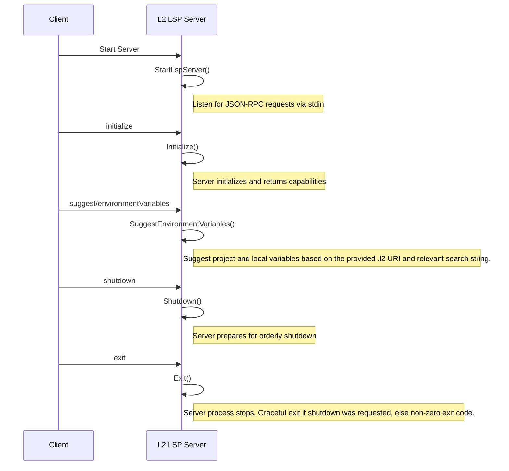

### Life Cycle of events in l2-lsp

```mermaid
sequenceDiagram
    participant C as Client
    participant S as L2 LSP Server

    C->>S: Start Server
    S->>S: StartLspServer()
    Note right of S: Listen for JSON-RPC requests via stdin

    C->>S: initialize
    S->>S: Initialize()
    Note right of S: Server initializes and returns capabilities

    C->>S: suggest/environmentVariables
    S->>S: SuggestEnvironmentVariables()
    Note right of S: Suggest project and local variables based on the provided .l2 URI and relevant search string.

    C->>S: shutdown
    S->>S: Shutdown()
    Note right of S: Server prepares for orderly shutdown

    C->>S: exit
    S->>S: Exit()
    Note right of S: Server process stops. Graceful exit if shutdown was requested, else non-zero exit code.
```