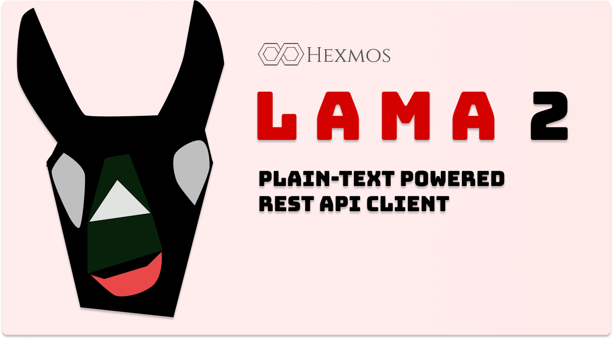

# **`Lama2`**: Plain-Text Powered REST API Client for Teams :llama:




[](https://goreportcard.com/report/github.com/HexmosTech/lama2)


<a href="https://www.producthunt.com/posts/hexmos-lama2?utm_source=badge-featured&utm_medium=badge&utm_souce=badge-hexmos&#0045;lama2" target="_blank"></a>


## About

*Lama2* is a Plain-Text powered REST API client & manager built for serious engineering teams.
*Lama2* specifies the [`.l2` syntax](tutorials/examples.md) for describing APIs, and implements a [CLI](tutorials/installation.md) to execute `.l2` files. Engineers [collaborate](tutorials/collaboration.md) on `.l2` files using version control. *Lama2* [integrates](tutorials/editor.md) nicely with
IDEs and text-editors as well. Think of *Lama2* as [**Markdown for APIs.**](reference/philosophy.md)
## Benefits

1. **Plain-Text files:** Store APIs in the Plain-Text `.l2` API files. [Simple](explanation/l2format.md) and [human-friendly](explanation/syntax.md) syntax. Learn [basics](tutorials/examples.md) within  minutes!
1. **Simple CLI:** Launch the [CLI](tutorials/installation.md) tool `l2` on API files to make REST API requests.
1. **Editor support:** Invoke *Lama2* from your [favorite text editor](tutorials/installation.md#from-vs-code) or IDE. Helpful documentation and tool support to [build editor extensions](tutorials/editor.md) included.
1. **Longevity & track-ability:** Commit `.l2` files to `git` or other version control for long life & change tracking.
1. **Collaboration:** Share [API repo](tutorials/collaboration.md) with teammates and colleagues to collaborate
1. **Documentation:** [Explore](index.md) examples, how-tos, explanations, references, FAQ/RAQs, and diagrams. Documentation is a priority, so that you never have to get lost.
1. **Extensibility:** `.l2` syntax is implemented as a *recursive descent parser*, based on a [formal grammar](reference/grammar.md). [Dig into details](reference/parser.md) and [implement](https://github.com/HexmosTech/Lama2/tree/main/parser) new syntax (ex: to support `websockets`)
1. **Import from Postman:** Let *Lama2* help you [convert](tutorials/postman.md) Postman
data dumps into a  nice  Plain-Text Lama2 repo.


## Terminal Demo: A POST request


**`basic_post.l2`:**

```bash
POST
https://httpbin.org/post
{
    "hello": "world"
}
```

**Execute:**

```
l2 basic_post.l2
```

## VSCode Demo: The same POST request


## Community and Support

1. [Full documentation @hexmos.com/lama2](https://hexmos.com/lama2/)
1. Report issues and propose improvements at [Github issues](https://github.com/HexmosTech/Lama2/issues)
1. Discuss with the community at [Discord](https://discord.gg/zTmxXA6F)
