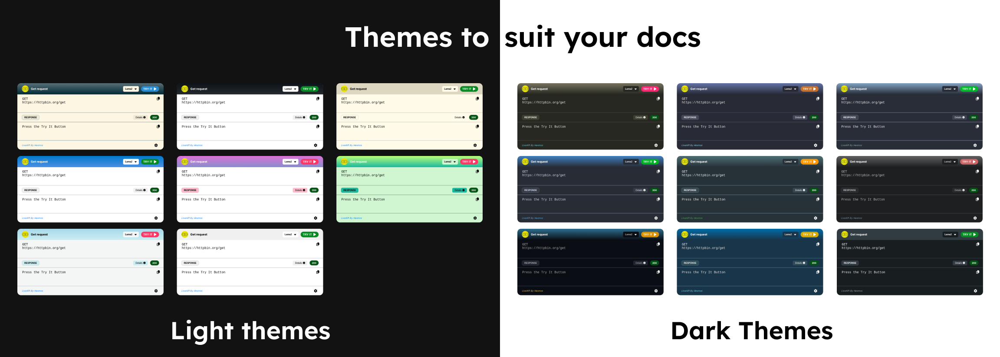

# LiveAPI: Capture Developer Attention Instantly with Executable API Docs

Static API docs often lose customer attention before the developers even try your APIs.

With LiveAPI, developers can execute APIs instantly right within their browser, so that you capture developer attention within the first 30 seconds of their visit.

LiveAPI uses Lama2 Language for executing the API requests, and supports language conversion as well.

---

## Features available

### 1. Execute APIs from Anywhere
With LiveAPI integrated into your API documentation, users can directly test your API by simply clicking the "Try it" button.

### 2. Easy to Plug-in
LiveAPI is designed with simplicity in mind. You only need to import a single script with your desired parameters to get started. No complex setup required.

### 3. Customization Options
LiveAPI provides plenty of customization to suit your needs, you can personalize the widget by adding Logos as well as links to your API Docs.
A Theme selector is also available, so you can make sure the widget fits in well with your documentation style.

### 4. Code Converter
Our built-in code converter feature allows the users to convert requests to any language of their choice. This makes it easier for the developers to integrate APIs to any environment.
