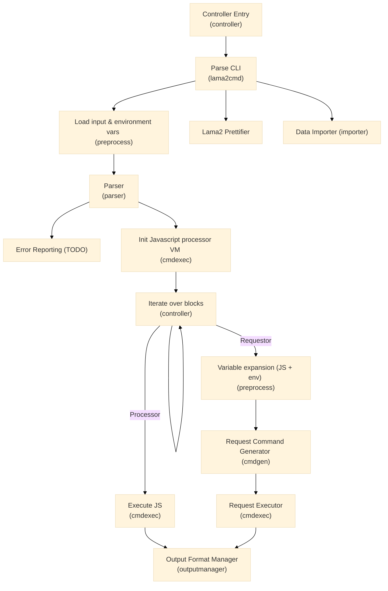

### Diagram

### Description

From a high level, how does it work now?

1. Read API file
2. Create a tree-like structure based on `*gabs.Container`
3. Initialize Javascript VM for executing JS blocks
4. For each block
	1. If block is JS Processor block
		1. Execute JS code in VM
	2. Else if block is Requestor block
		1. Replace variables with values in the following order
			1. Try fetch variable from Javascript VM
			2. If (1) fails, try fetch Local env variable from `l2.env` 
      3. Try fetch root env variable from `l2config.env`
		2. Use the processed elements to create an httpie-go request
		3. Fetch response
5. If necessary, write the last transaction to `.json` file