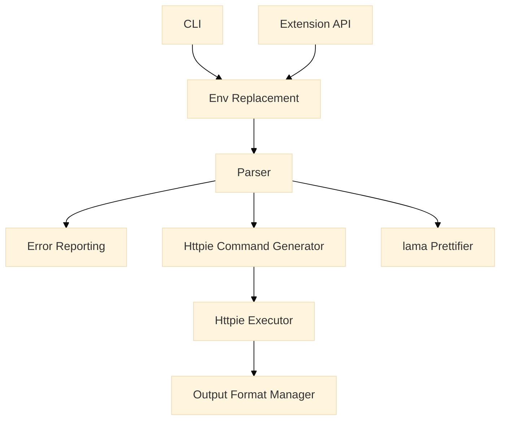

```mermaid
%%{init: {'securityLevel': 'loose', 'theme':'base'}}%%
graph TD
	A[CLI]
	B[Parser]	
	C[Extension API]
	D[Httpie Executor]
	E[Output Format Manager]
	F[Error Reporting]
	G[Env Replacement]
	H[Httpie Command Generator]
	I[lama Prettifier]
	A --> G
	C --> G
	G --> B
	B --> F
	B --> H
	H --> D
	D --> E
	B --> I
```
