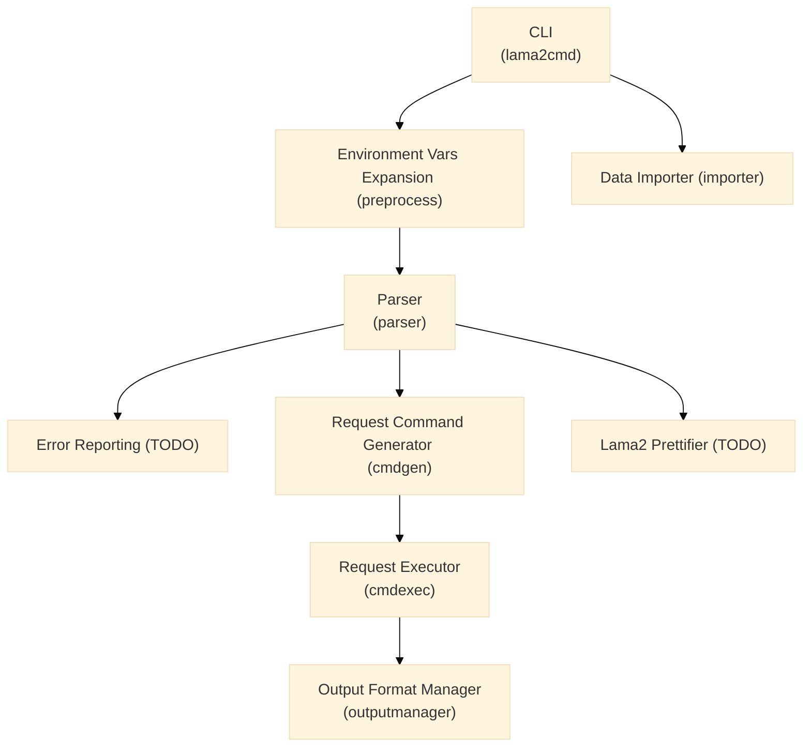

```mermaid
%%{init: {'securityLevel': 'loose', 'theme':'base'}}%%
graph TD
	A["CLI <br/>(lama2cmd)"]
	B["Parser <br/>(parser)"]	
	D["Request Executor <br/>(cmdexec)"]
	E["Output Format Manager <br/>(outputmanager)"]
	F["Error Reporting (TODO)"]
	G["Environment Vars Expansion <br/>(preprocess)"]
	H["Request Command Generator <br/>(cmdgen)"]
	I["Lama2 Prettifier (TODO)"]
	J["Data Importer (importer)"]
	A --> G
	A --> J
	G --> B
	B --> F
	B --> H
	H --> D
	D --> E
	B --> I
```
