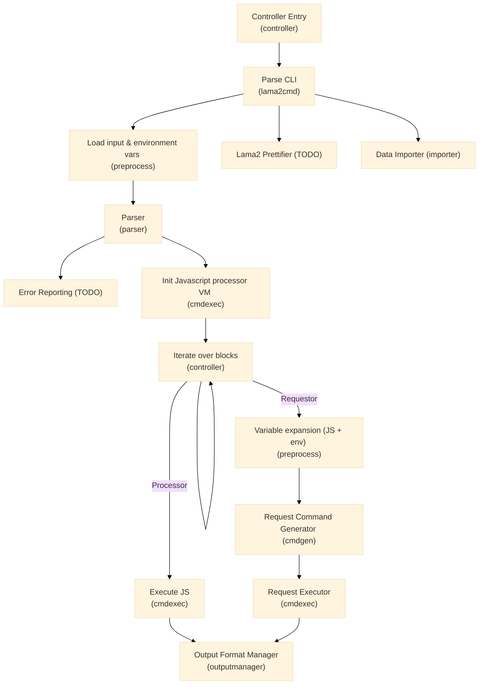

```mermaid
%%{init: {'securityLevel': 'loose', 'theme':'base'}}%%
graph TD
	K["Controller Entry <br/>(controller)"]
	A["Parse CLI <br/>(lama2cmd)"]
	B["Parser <br/>(parser)"]	
	D["Request Executor <br/>(cmdexec)"]
	E["Output Format Manager <br/>(outputmanager)"]
	F["Error Reporting (TODO)"]
	G["Load input & environment vars <br/>(preprocess)"]
	H["Request Command Generator <br/>(cmdgen)"]
	I["Lama2 Prettifier (TODO)"]
	J["Data Importer (importer)"]
	L["Iterate over blocks <br/>(controller)"]
	M["Init Javascript processor VM <br/>(cmdexec)"]
	N["Execute JS <br/>(cmdexec)"]
	P["Variable expansion (JS + env) <br/>(preprocess)"]
	A --> G
	A --> J
	G --> B
	H --> D
	K --> A
	B --> M
	M --> L
	L --> |Requestor| P
	L --> |Processor| N
	N --> E
	D --> E
	B --> F
	A --> I
	P --> H
	L --> L
```
