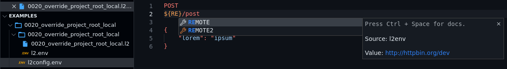
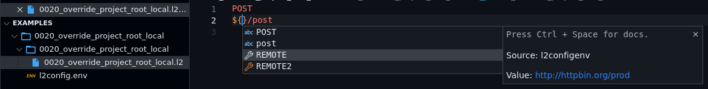

## Useful Options 
The `l2` command provides some helpful options for
extension developers. The options are:

1. `--env` or `-e` outputs a JSON of environment variables (in CLI);
2. `--nocolor` or `-n` disables colored output in httpie-go (in CLI);
3. `--output=<target.json` or `-o` writes a structured JSON
output to the target file (without colors). The following is the content
structure:

```json
{
    "logs": ...,
    "headers": ...,
    "body": ...
}
```

- `logs`: String value. Contains ASCII-color-coded log output. Control the logging level through `-v` option
- `headers`: A string consisting of `HTTP header: Value` pairs separated by newline.
- `body`: A string containing the HTTP response. Usually a JSON or HTML response.


!!! note

    Right now, all the three values in the JSON are strings. In the future, we may transform the values further to provide a more parse-friendly structure.

## The Commands

### Execute current file
Combining the options `-n` and `-o`, we get:

```bash
l2 -n -o /tmp/lama2.json my_api.l2
```

The command mentioned above disables HTTPie colors,
writes the whole transaction to a structured JSON, 
while also printing details into `stdout`.

The extension author can simply read the file, and
display the contents to users appropriately. For an
example, see [Lama2 for VSCode](https://github.com/HexmosTech/Lama2Code)
(also see [Marketplace page](https://marketplace.visualstudio.com/items?itemName=hexmos.Lama2)).

### Providing environment variable autocompletion 
To obtain a combined JSON representation of environment variables from `l2.env` and `l2config.env`, use option `-e` or `--env`. This will output the result to `stdout`.
```bash
l2 -e  /path/to/my_api.l2
```
```json
{
  "AHOST": {
    "src": "l2env",
    "val": "http://127.0.0.1:8000"
  },
  "BHOST": {
    "src": "l2configenv",
    "val": "https://httpbin.org"
  }
}
```
The extension author can simply read the `stdout` after executing the command, and display the variables to users appropriately.





Go to [Example](../tutorials/examples.md#case-3-override-root-variable-with-local-variable)

## Syntax Highlighting

The VSCode plugin implements a rudimentary syntax highlighting for `.l2` files. We use [Iro](https://eeyo.io/iro/documentation/) for syntax grammar generation. Find [more details](https://github.com/HexmosTech/Lama2/tree/main/syntax/README.md) if interested.