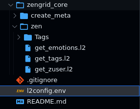

# Examples

The following examples provide a sampling of
the various types of requests *Lama2* handles
presently. Execute each file as:

```
l2 <file_name>.l2
```

You can also clone the repo and open it up in
VSCode, install the *Lama2* extension and fire
requests from there.

## GET request

```
GET
https://httpbin.org/get
```

Get [Source File](https://github.com/HexmosTech/Lama2/tree/main/examples/0000_sample_get.l2)

## JSON POST request

One can dump the JSON body at the end of an `.l2` file to create a POST request:

```
POST
https://httpbin.org/post

{
    "a": "b",
    "c": "d"
}
```

Get [Source File](https://github.com/HexmosTech/Lama2/tree/main/examples/0002_sample_post.l2)

## JSON POST in VarJSON format

Make a POST request with JSON body specified
as `key=value`. *Lama2* converts the input into
a corresponding JSON value `{"a": "b", "c": "d"}`. We call the `key=value` format _VarJSON_. This example produces an effect identical to the [previous one](#basic-json-post)

```
POST
https://httpbin.org/post

a=b
c=d
```

Get [Source File](https://github.com/HexmosTech/Lama2/tree/main/examples/0001_sample_post_varjson.l2)

## Comments

One can start a comment anywhere in the file
with the `#` character.

```
# Pound symbol signifies a comment
POST
https://httpbin.org/post

a=b # Comments may start at the end of lines as well
c=d

# Comments work even after the payload
```

Get [Source File](https://github.com/HexmosTech/Lama2/tree/main/examples/0003_comment.l2)

## Environment Variables: Switch base URL

### Case 1: `l2.env` adjacent to an API file

For any given `.l2` file, one can place an `l2.env` file to store relevant variables.
These variables will be available to be used within the API file

**l2.env**

```
export LOCAL="http://localhost:8000"
export REMOTE="http://httpbin.org"
```


Get [Source File](https://github.com/HexmosTech/Lama2/tree/main/examples/0023_l2env_declare)

### Case 2: Root variables

In Lama2, you can have a large number of API files stored in a hierarchical folder configuration.
The root of such a project can be signified through `l2config.env`:

Within such a structure, you can have an API file anywhere, which can use variables defined in the root variables:
**l2config.env**

```
export LOCAL="http://localhost:8000"
export REMOTE="http://httpbin.org"
```


Get [Source File](https://github.com/HexmosTech/Lama2/tree/main/examples/0022_l2config_declare)

### Case 3: Override Root variable with local variable

In this structure, if a variable is declared in both l2config.env and l2.env, the value from l2.env takes precedence.


Get [Source File](https://github.com/HexmosTech/Lama2/tree/main/examples/0020_override_project_root_local)

## Headers

Use `key:value` format to specify headers.

Specify strings for key/value in three ways:

1. Double quoted (`"hello"`)
1. Single quoted (`'hello'`)
1. Unquoted (`hello`)

```
POST
https://httpbin.org/post

# HEADERS
X-Parse-Application-Id:'helloworld'
X-Parse-REST-API-Key:"byeworld"

# DATA
a="b"  # double-quoted string
'c'=d  # single-quoted & unquoted strings
```

Get [Source File](https://github.com/HexmosTech/Lama2/tree/main/examples/0005_headers_simple.l2)

!!! Note

    The data section may appear *before* headers as well (see below)

```
POST
https://httpbin.org/post


# DATA
a="b"  # double-quoted string
'c'=d  # single-quoted & unquoted strings

# HEADERS
X-Parse-Application-Id:'helloworld'
X-Parse-REST-API-Key:"byeworld"
```

## Send cookies in header

Headers represent cookies in _Lama2_. Just specify cookie key value pairs separated by
`=` within the header value as shown.

```
POST
https://httpbin.org/post

# HEADERS
Cookie:"sessionid=foo;another-cookie=bar"

# DATA
hello=world
```

Get [Source File](https://github.com/HexmosTech/Lama2/tree/main/examples/0006_cookies.l2)

## Fill forms & attach files with MULTIPART

Use the `MULTIPART` keyword after the HTTP
verb to enable forms and file attachments.

The data section may contain any number of
form inputs using the `key=value` syntax.

Following the data section, one can specify
any number of files in the form of `<field_name>@<file_path>`. The file path is
relative to the API file.

```
POST
MULTIPART
http://httpbin.org/post

'X-Parse-Application-Id':hello
X-Parse-REST-API-Key:"world"

# DATA
first=second

# FILES
myfile@./image.jpeg
```

Get [Source Files](https://github.com/HexmosTech/Lama2/tree/main/examples/0007_multipart_file)

## Image as Base64 encoded JSON field

We can embed images (or other files) as
base64 strings in JSON using _Lama2_.

First, we define a `PHOTO` variable, loaded
up with the results of the `base64` command.

**l2.env**

```
export PHOTO=`base64 -w 0 image.jpeg`
```

Next, we refer to the `PHOTO` variable in
the API file. Pay special attention to the
quoting mechanism `"'{PHOTO}'"`.

!!! warning

    **The quoting
    must look exactly as shown in the following
    template for the request to work correctly.**

**base64_embed.l2**

```
POST
http://httpbin.org/post

{
	"imageb64_field": "'${PHOTO}'",
}
```

Get [Source Files](https://github.com/HexmosTech/Lama2/tree/main/examples/0008_base64_image)

## Chain requests using Javascript

In Lama2, we have alternating requestor and processor (JS) blocks, separated by `---`.

Each processor (JS) block has a special variable `result`, storing the response
from previous requestor block. If possible,
`result` is automatically stored as a JS
object through `JSON.parse()`. Otherwise,
`result` is stored as a regular `string`.

```
url = "http://google.com"
REMOTE_COORD = "https://httpbing.org"
---
# stage 1

POST
${REMOTE_COORD}/anything

{
    "username": "admin",
    "password": "Password@123",
    "from": "${LOCAL_COORD}/anything",
    "url": "${url}",
    "Token": "MySuperSecretToken"
}

---

// filtering, store in var
console.log("@@Result", result)
let TOKEN = result["json"]["Token"]
console.log(TOKEN)

---

# stage 2
GET
${REMOTE_COORD}/bearer

Authorization: 'Bearer ${TOKEN}'

{}
```

Get [Source Files](https://github.com/HexmosTech/Lama2/tree/main/examples/0009_processor_basic)
