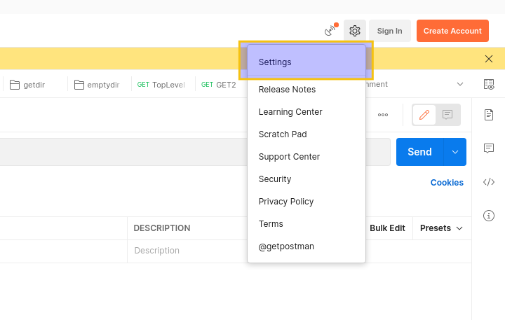
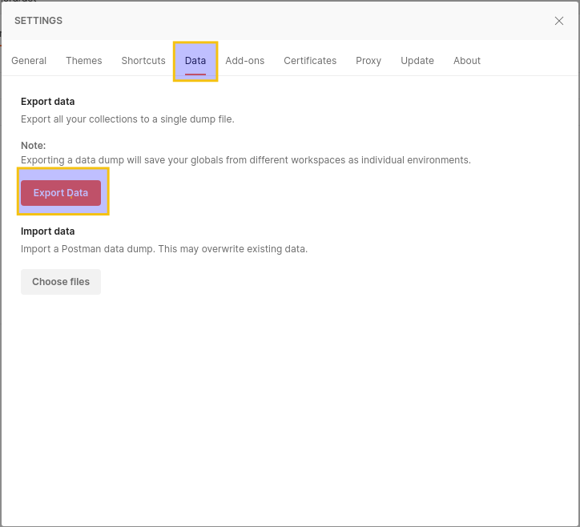

*Lama2* ships with a rudimentary converter from Postman
to a Plain-Text Lama2 API repository. The converter presently
is in an embryonic state and may merely produce approximate
results.

## 1. Export from Postman

### 1.1 Access Settings



### 1.2 Data Export



!!! warning

    **Although postman offers more selective exporting (collection, folder, request levels), Lama2 presently supports only the whole-data export depicted above.**

The above step must produce a `.json` file. 

## 2. Convert Postman `.json` dump into Lama2 API repo

Run the following to convert the postman data dump into
a Lama2 API structure. 

```
l2 -p postman_dump.json -l my_l2output_dir
```

The command will prompt for an environment. Select the
environment which you wish to export. Once you pick the option,
*Lama2* will produce the `my_l2output_dir` directory
filled with the original organizational hierarchy and a bunch
of `.l2` and `l2.env` files.